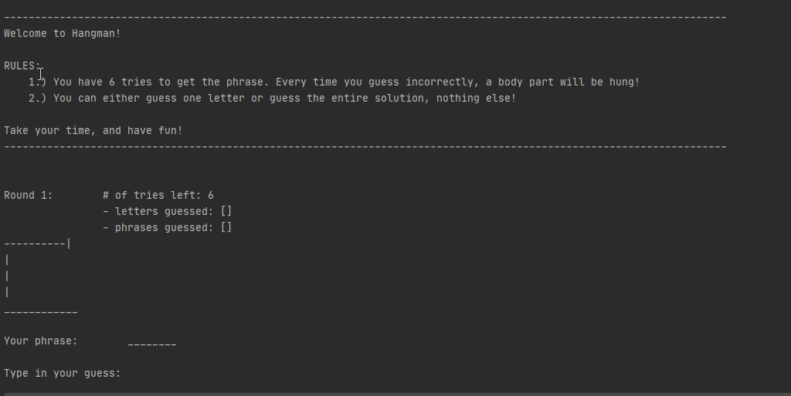

# Hangman
This is a re-creation of the classic game: Hangman! Made with Python and played on the terminal! This small program was created as an assignment for the course: CS 3750 - Computers and Society at Cal Poly Pomona!

## Demo of Play:

**NOTE: A phrase is only a valid guess when it is a legitmate guess! i.e. the size of the guessed phrase = the size of the solution!

### Technologies Used:
- Language: Python
- IDE:  PyCharm
- random library, File opening/reading

### Improvements to be Made:
- [ ] Make it into a GUI form!
- [ ] Turn it into an object class! 
